
全球商店数据包设计文档

- by Mini_Ye
 
2024/01/20

---
# 一. 简介
## 1.1 文档适用范围

由于数据包特性变化较多，本文档仅指导本数据包第三个版本的开发。

## 1.2 背景和目的
minecraft 原版无方便快捷的玩家间交易方式和服务器统一出售方式。本数据包为多人游戏提供便捷的交易功能和各种附加功能，方便玩家进行交易和管理员管理。

## 1.3 参考文章
略

## 1.4 缩略语和术语
- 数据包名：GlobalShop
- 数据包中文名：全球商店

# 二. 项目信息
## 2.1 作者
| 游戏ID    | 网站     | 联系方式 |
| --------- | ------------ | -------- |
| Mini_Ye   | [B站主页][1] | b站私信  |
| Alumopper | [雪狐小窝][2]  | - |

## 2.2 发布链接

TODO

# 三. 需求分析
## 3.1 需求描述
- 玩家可以出售自己的物品、浏览和购买他人出售的物品
- 玩家可以浏览自己的历史购买和出售记录
- 管理员可以设置服务器统一出售的物品，数量无限，供玩家浏览和购买
- 管理员可以设置服务器统一回收的物品，数量无限，供玩家回收物品赚取收入
- 管理员可以设置使用某种数量的自定义物品兑换一定数量的金钱，玩家可以通过该兑换功能进行物品和金钱间的兑换（服务器的“纸币”）

## 3.2 未来特性
- 禁止出售某些 id 的物品
- 全球商店黑名单

## 3.3 设计约束

本数据包管理的数据大量来自玩家的输入，需要谨慎设计，在基本不影响功能的前提下最大程度减小攻击面，并且不影响服务器稳定性。
- **版本特性：** 仅支持 JE 1.20.4 版本，其他版本需重新评估适配性
- **性能：** 随着玩家数量增多，单个游戏刻运行命令可能过多，考虑限制：
  - 同时使用商店的玩家数量（管理员不受限制）
  - 两次主循环之间间隔更多游戏刻
- **存储：** 随着玩家数量增多，出售的物品、历史记录会使 storage 存储文件持续增大，考虑限制：
  - 注册的玩家数
  - 每位玩家上架到玩家商店的物品数量
  - 每位玩家存储的最大历史记录数量

# 四. 框架设计
## 4.1 数据包信息

- **数据包名：** GlobalShop
- **命名空间：** global_shop
- **实体 Tags 标签前缀：** glbs_
- **物品 NBT tag 标签：** global_shop
- **记分板前缀：** glbs_
- **队伍前缀：** glbs_
- **实体共同标签：** global_shop

## 4.2 模块划分

### 4.2.1 主逻辑模块
包含数据包运行的主要逻辑，包括玩家交互。

#### 4.2.1.1 类型和常量定义
见文件 code.md

#### 4.2.1.2 模块逻辑

Scheduler 类的 Tick 函数注册进 tick.json，每个游戏刻由游戏调用

参考 UI 展示模块的图片，玩家打开商店时，会生成 Menu 实体（一个方块展示实体，外观是脚手架），上面骑着玩家和交互实体，玩家面前一定距离有多个物品展示实体构成界面，玩家将鼠标停在物品上时，会出现文本展示实体展示物品的具体信息。Menu 实体代表这一整个单元，所以在类图中可以看到很多类都与 Menu 类关联。

Scheduler#Tick 函数调到 Shop#Perform，接着调用每个 Menu 实体的 Perform，完成对每位玩家的处理。

不同模式下，Menu 对象会调用对应模式的 handler 进行不同的处理，总的来说处理有两类：
- 菜单：菜单对应的物品展示实体基本不变。例如主菜单、玩家商店主菜单、编辑模式菜单等等，除非切换模式，否则菜单的位置一般不变。通过玩家视角判断看向的物品
- 展示：玩家旋转视角，逐渐展示新的物品

**Scheduler 类：**

定时器
- 按一定频率执行 Shop#Perform
- 每隔一定时间检查残留实体并清除（生成的实体可能由于区块卸载或玩家退出等问题产生残留，每隔一定时间检查这些实体并清除）

**Shop 类：**

负责整个数据包维度的操作
- 调用各个 Menu 对象进行处理
- 处理玩家打开商店的请求

**Menu 类：**

负责各个玩家的商店操作
- 判断玩家脱离并关闭商店
- 判断玩家长时间不操作并关闭商店
- 判断玩家在打开商店时退出游戏且重新进入并关闭商店
- 不同模式下的处理逻辑

### 4.2.2 UI模块
供主逻辑模块调用，根据物品数据生成物品展示实体，形成 UI 菜单。

**菜单示例: **

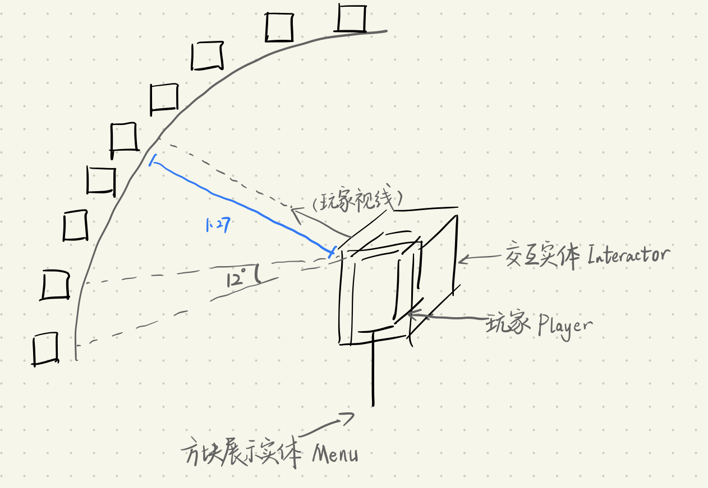

玩家打开商店的整体组合

 

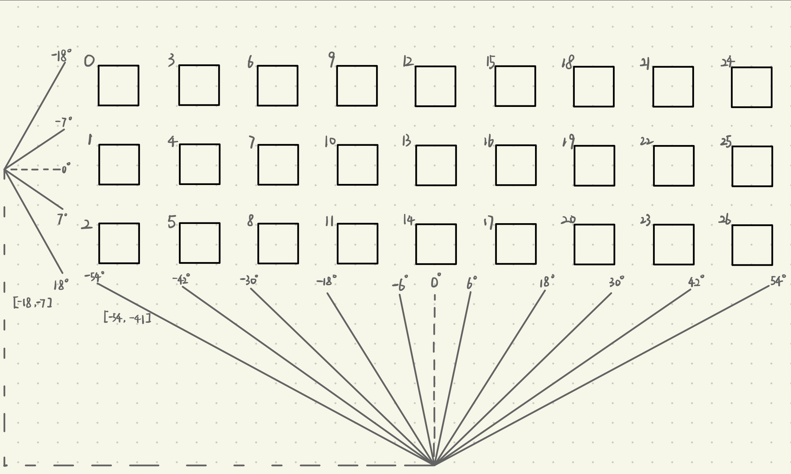

ui

具体接口详见数据模型。

### 4.2.3 存储模块
供主逻辑模块调用，将数据存入 storage。
提供不同模式下对 storage 的操作接口，详见数据模型。

## 4.3 视图
### 4.3.1 用例视图

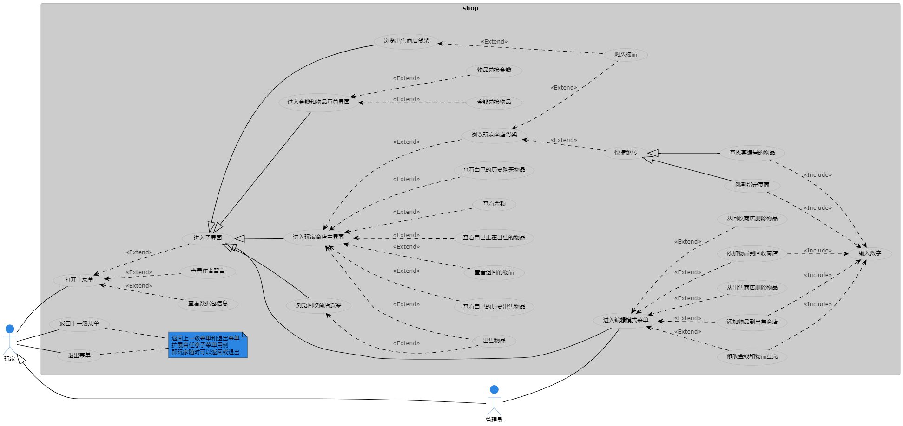

用例视图

### 4.3.2 逻辑视图

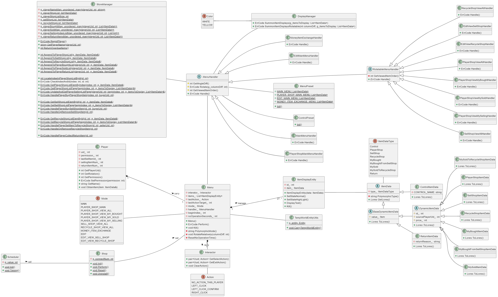

逻辑视图

### 4.3.3 开发视图

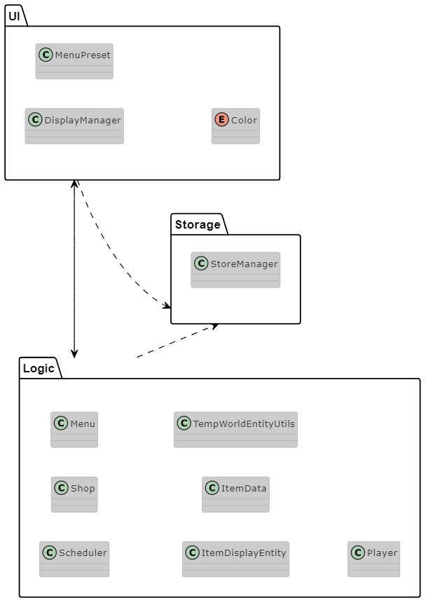

开发视图

### 4.3.4 运行视图

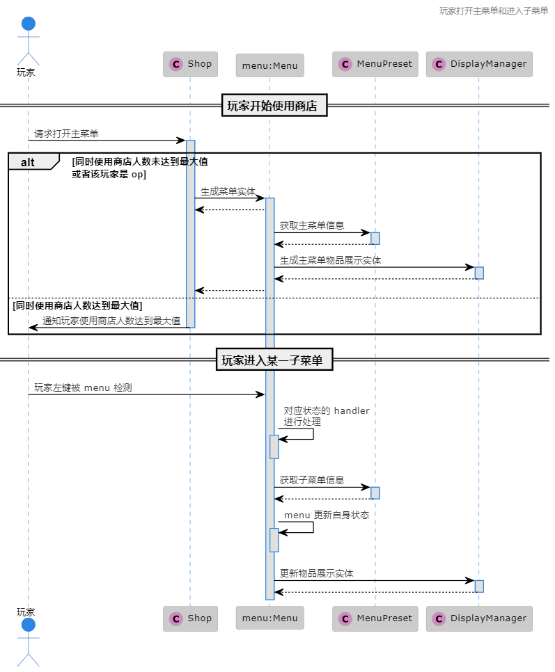

玩家打开主菜单和进入子菜单

 

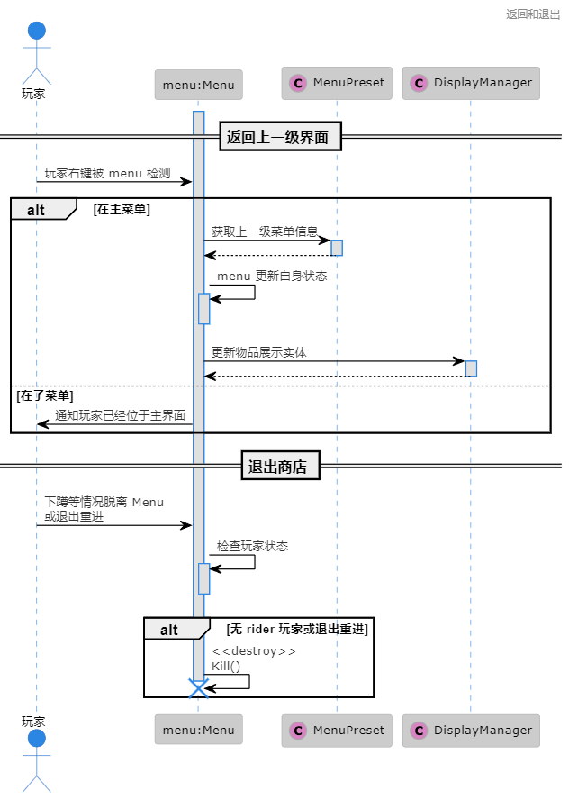

返回和退出

 

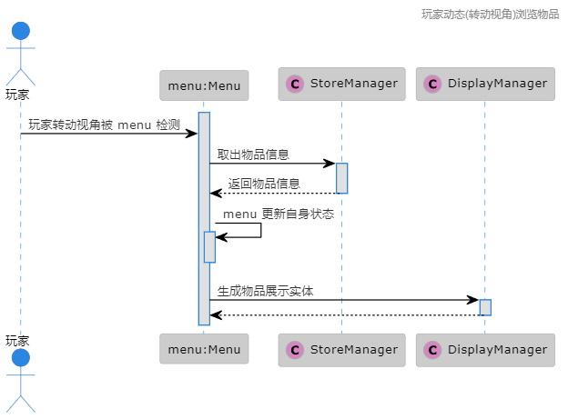

玩家动态(转动视角)浏览物品

 

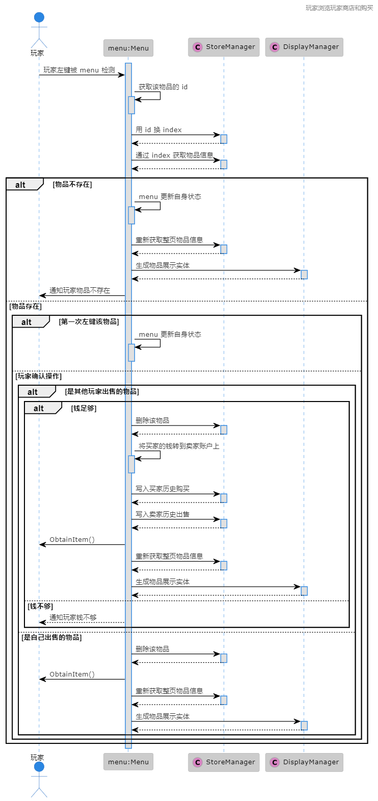

玩家浏览玩家商店和购买

 

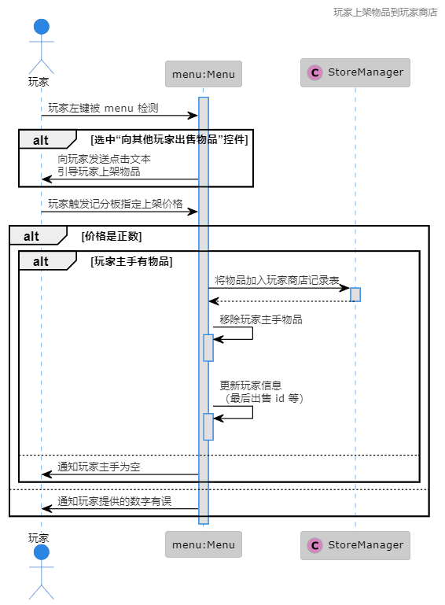

玩家上架物品到玩家商店

 

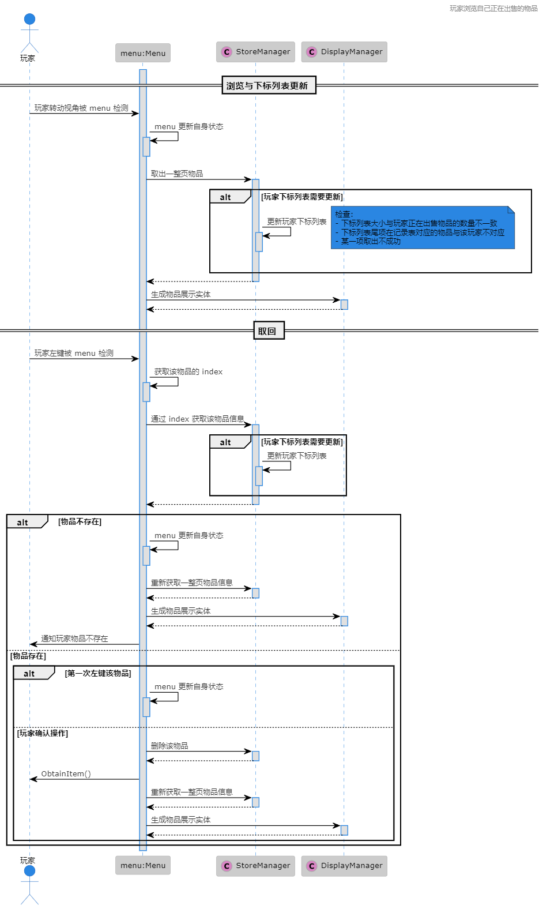

玩家浏览自己正在出售的物品

 

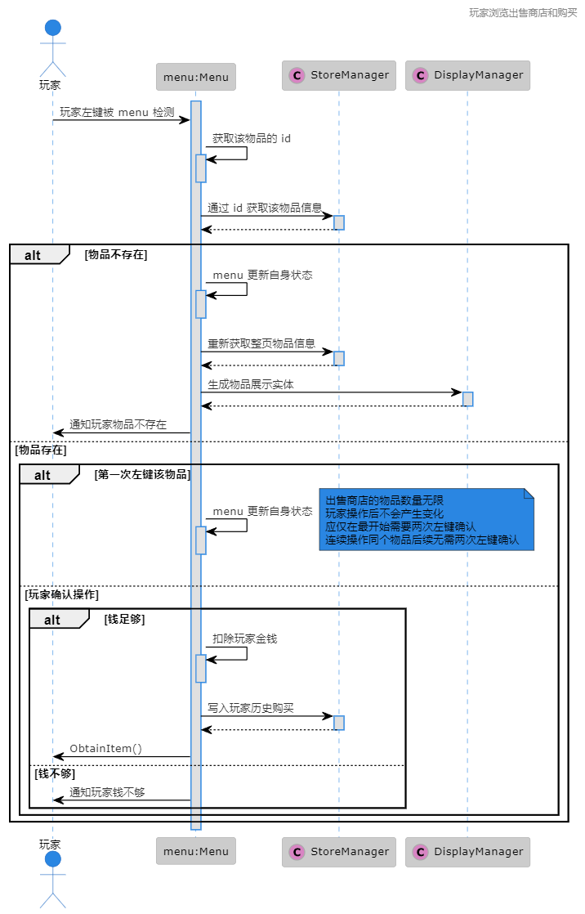

玩家浏览出售商店和购买

 

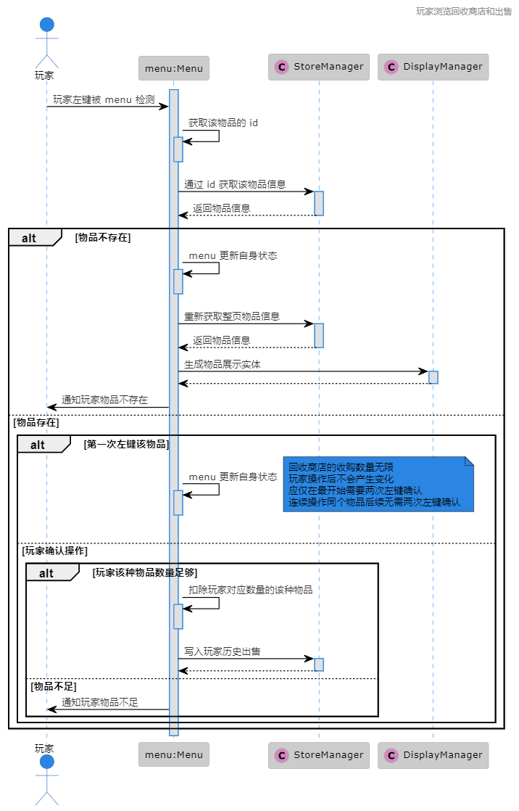

玩家浏览回收商店和出售

 

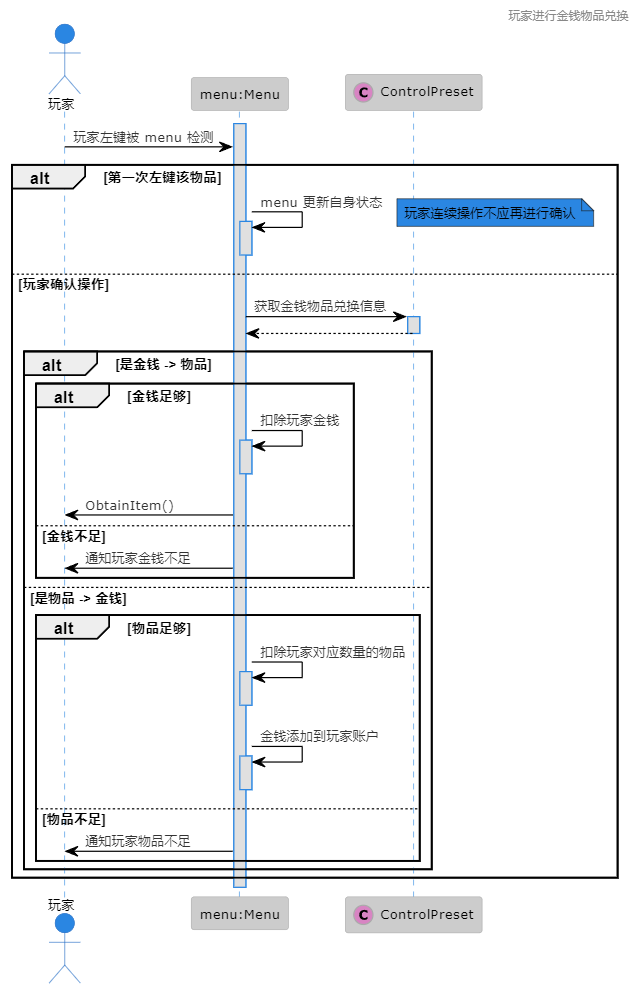

玩家进行金钱物品兑换

 

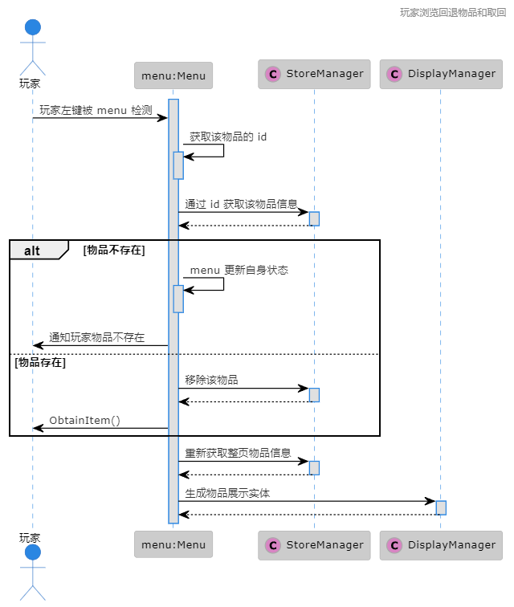

玩家浏览回退物品和取回

 

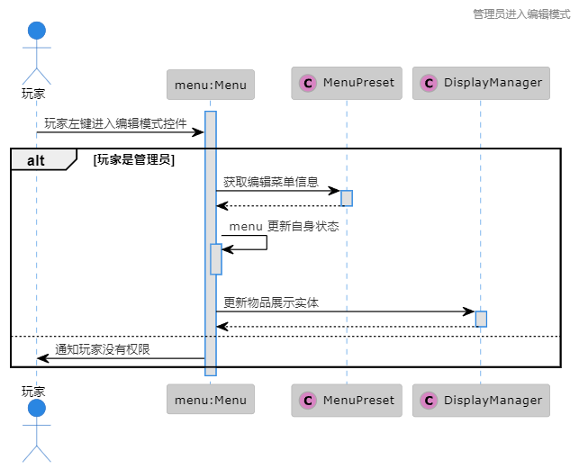

管理员进入编辑模式

 

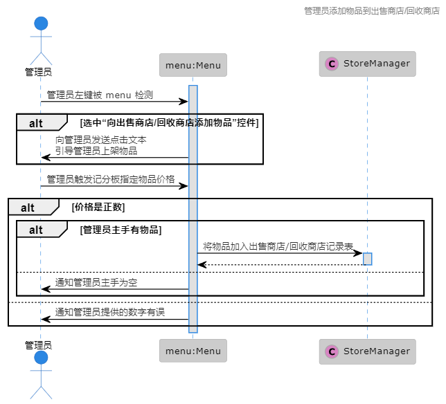

管理员添加物品到出售商店/回收商店

 

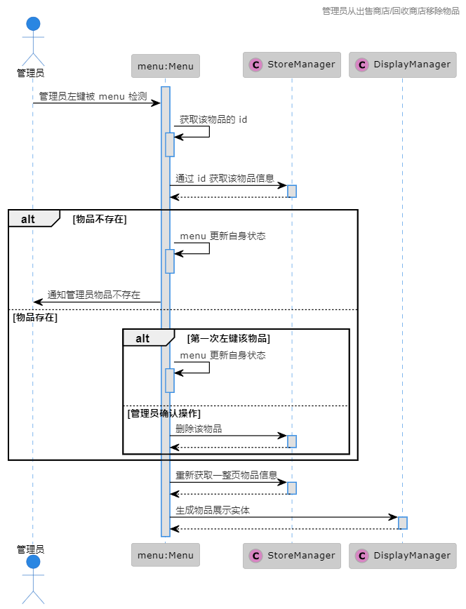

管理员从出售商店/回收商店移除物品

 

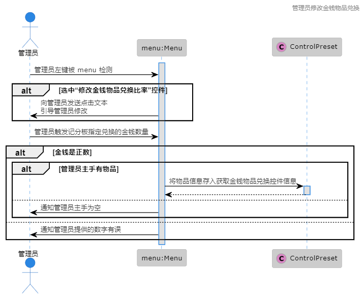

管理员修改金钱物品兑换

### 4.3.5 部署视图
略，将本数据包添加到存档 datapacks 文件夹。

# 五. 代码异味
## 5.1 功能异味
- 同时多位玩家使用商店时，考虑性能，若有玩家的操作使物品产生变化，其他玩家并不能马上得知（例如多位玩家在浏览玩家商店，此时有玩家新上架物品，则其他玩家的界面不能马上更新出这个新物品，只能等玩家转动视角或者进行左键操作触发更新，才能显示出该物品）。

## 5.2 架构异味
- 由于 minecraft 和数据包的独特特性，一些处理杂糅在主逻辑模块中（例如交互），这是 minecraft 数据包开发天然存在的问题，无法避免。大量使用函数宏可以做到完全传参，进一步解耦模块，但是增加运行时解析命令的成本，经作者考虑，暂时不采用该做法，优先照顾运行占用。

## 5.3 代码异味
- 上述视图中，类仅帮助理解，实际运行时无类的概念，实体无法“持有”另一个实体的引用，对象的包含关系和多态运行仅方便理解，代码开发阶段仍依赖于开发者对命令的理解。
- 存在大量的重复代码，例如对 storage 不同列表的操作，仅仅是操作的表不同，语句几乎完全相同，这可以使用函数宏特性实现，但增加运行时解析命令的成本，经作者考虑，暂时不采用该做法，优先照顾运行占用。
- 物品进行编号依赖记分板，存在 int 类型上限的问题，但由于数字太大，几乎不可能达到，暂时不考虑其影响。
- 生成的实体可能由于区块卸载或玩家退出等问题产生残留，主逻辑每隔一定时间会检查这些实体和清除，这会短暂影响视觉效果（玩家可能看到残缺的商店界面，随后被清除，但属于低概率事件）。

[1]:https://space.bilibili.com/133430292
[2]:https://alumopper.top/